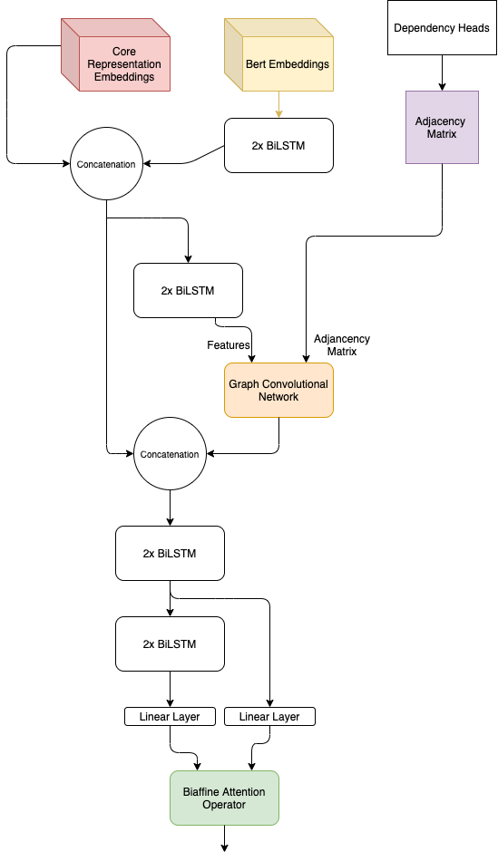
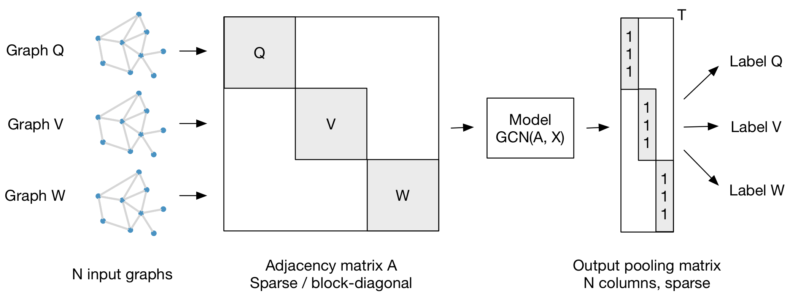

# Semantic Role labeling - Syntax-aware, BERT, Biaffine Attention Layer

This repository reports the research carried out in the field of Semantic Role Labeling during the Natural Language Processing course for the academic year 2019/2020 of Professor Roberto Navigli.

You can consult the report here and the slides used for the presentation here.

The code was developed with Pytorch.

My work got the highest macro f1 score of the whole class.

This model makes use of syntactic features via Graph Convolutional Network, Contextualized word embeddings (bert) and the Biaffine Attention Layer.

In this image you can see the final model:


### GCN 
To exploit the syntactic features I used the GCN layer from the work of Kipf & Welling as done by Marcheggiani et al.

I started from the information of the syntactic features contained in the dependency heads from which I built an indirect graph with self loops, in order to consider the node itself.
I expressed this graph in matrix form, using an adjancency matrix. This adjacency matrix has been normalized to avoid the vanish & exploding gradient problem. Multiplying the adjacency matrix by its inverse degree matrix.

#### GCN Batch wise training

In order to support batches I used a block diagonal matrix, where all the adjacency matrix of a batch are present along the diagonal. As shown in the figure below.


### BERT

I used bert-base-cased to produce non-trainable contextualized word embeddings.
As a pooling strategy I added the last 4 hidden layers. To manage the word pieces produced by a single word I took their average.

To avoid the excessive use of the ram I used the 16 bit representation of the tensors of the bert embeddings. The bert embeddings is placed in the CPU and only the portion of the batch is transferred to the GPU when used and then returned to the CPU.

## To execute the project

You should download and extract the vocabs and pre-trained model from this [link](https://mega.nz/file/AkhjGbIC#TMZshK4ZNHpJ0bK_OTb6h1jBzLleZO_Bc3GoFvOL3f0) and place it into the model/ folder.

```sh
conda create -n nlp2020-hw2 python=3.7
conda activate nlp2020-hw2
pip3 install -r requirements.txt
conda activate nlp2020-hw2
bash test.sh data/baseline.json
```


## Authors

*   **Andrea Bacciu**  - [github](https://github.com/andreabac3)
